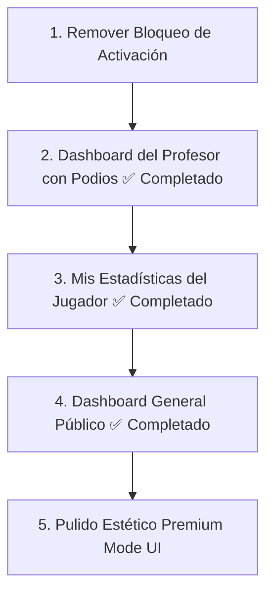

# 📊 Auditoría y Plan de Acción: FieldStats MVP 1.0 - ACTUALIZADO
*Preparado por Antigravity (Socio Fullstack & Asesor de Negocios Digitales) para la Goethe Schule*

---

## 1. Evaluación de Negocio y PMF (Product-Market Fit)
Ataca un dolor administrativo y reduce quejas de padres al documentar asistencia y rendimiento con datos reales.

---

## 2. Diagnóstico Técnico y Avances Recientes

### ✅ Tarea 2 Completada: Módulo de Convocatorias y Confirmación
- **Base de Datos**: Se incorporó la columna `Confirmado` en la hoja `CONVOCATORIAS`.
- **Backend (`Code.gs`)**:
  - `responderConvocatoria(idp, dni, asiste)`: Guarda si el alumno asiste ("Si") o no ("No") en la columna 5, asegurando que la cabecera "Confirmado" se agregue si no existe.
  - `obtenerMisConvocatorias(dni)`: Ahora recupera y retorna el estado actual de confirmación, incluyendo el ID del deporte (`deporte`) para filtrado de frontend.
  - `obtenerJugadoresParaConvocatoria(idp)`: Devuelve el estado de confirmación al profesor para la visualización agregada.
- **Frontend (`index.html` + `funciones.html`)**:
  - **Panel del Jugador**: Rediseñado en una jerarquía unificada. El landing es un menú principal con tres tarjetas de igual jerarquía (Mis Convocatorias, Mis Estadísticas, Dashboard General). El Dashboard General de partidos/posiciones fue encapsulado en su propia pantalla limpia (`screen-dashboard-general-jugador`).
  - **Filtro de Deportes en Convocatorias**: Agregado un toggle group en "Mis Convocatorias" para alternar instantáneamente entre partidos de Fútbol (DEP1) y Handball (DEP2) mediante filtrado en Javascript.
  - **Panel del Profesor**: Visualización en tiempo real del estado mediante círculos de colores (🟢 Verde = Asiste, 🔴 Rojo = No Asiste, ⚪ Blanco = Sin responder, ⚫ Gris = No convocado). La tarjeta de "Estadísticas Generales" fue trasladada dentro del submenú de "3. Partidos y Estadísticas" (screen-partidos-menu) alineándose con el mockup.

### ✅ Bugs Críticos Resueltos
1. **Bug 1 (DNI no guardado)**: Resuelto. Se implementó la variable global `dniJugadorActual` para almacenar el DNI del jugador tras loguearse.
2. **Bug 2 (Typo en wizard)**: Corregido error de variable `r` por `res` al finalizar partidos.
3. **Bug 3 (Categorías hardcodeadas)**: Resuelto. Se implementó la lógica real escolar K-12 de corte julio-junio basada en el nacimiento del alumno y el año escolar.

---

## 3. Próximos Pasos (Hoja de Ruta)

